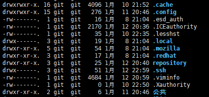
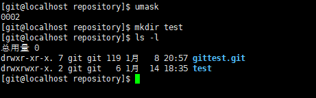

# Linux 文件目录和权限命令

Linux 一般将文件可存取的身份分为三个类别, 分别是 `owner/group/others`, 根据权限划分, 每个目录都可以拥有相对身份的 `-rwx`[可读可写可执行].

## 使用者与群组

Owner
    文件拥有者, 如 jane 拥有此文件所属权, 可对该文件进行相应权限操作

Group
    文件拥有组, 如一个 project 组中, 有三个人 person1, person2, person3, 而该文件被 project 组所拥有, 则组内的三个成员就可以对文件进行相应权限操作

Other
    其他所有者, 即除去 owner 和 group 的可执行的操作

## Linux文件属性

使用`ls -al`可查看当前目录下的文件(-a 显示隐藏文件, 以 . 开头的文件)

> [权限][链接][拥有者][群组][文件大小][修改日期][文件名]

[权限]：由十位字符组成, 代表这个文件的类型与权限
第一个字符代表这个文件是目录、文件或链接文件等等

    • 若是[ d ]则表示为目录, 例如上表文件名为“.config”的那一行
    • 若是[ - ]则表示为文件, 例如上表文件名为“esd_auth”那一行
    • 若是[ l ]则表示为链接文件（link file）
    • 若是[ b ]则表示为设备文件里面的可供储存的周边设备（可随机存取设备）
    • 若是[ c ]则表示为设备文件里面的序列埠设备, 例如键盘、鼠标（一次性读取设备）

接下来的字符中, 以三个为一组, 且均为“rwx” 的三个参数的组合

    • [ r ]代表可读（read）
    • [ w ]代表可写（write）
    • [ x ]代表可执行（execute）
    • 这三个权限的位置不会改变, 如果没有权限, 就会出现减号[ - ]
    • 查阅时可将类型与数据划分开: [-][rwx][r-x][r--]è1 234 567 890

        1 ：代表这个文件名为目录或文件
        234：拥有者的权限
        567：同群组使用者权限

[链接]：表示有多少文件名链接到此节点（i-node）

每个文件都会将他的权限与属性记录到文件系统的 i-node 中, 我们使用的目录树却是使用文件名来记录, 因此每个文件名就会链接到一个 i-node, 这个属性记录的, 就是有多少不同的文件名链接到相同的一个 i-node 号码.

[拥有者]：表示这个文件（或目录）的“拥有者帐号”

[群组]：表示这个文件的所属群组

[文件大小]：文件的容量大小, 默认单位为 Bytes

[修改日期]：文件的创建日期或者是最近的修改日期

[文件名]：文件的文件名

## 改变文件属性与权限

chgrp
    改变文件所属群组（change group）

> 被改变的群组名称必须要
在`/etc/group`文件内存在才行, 否则就会显示错误

chown
    改变文件拥有者(change owner)

> 使用者必须是已经存在系统中的帐号, 也就是在`/etc/passwd`这个文件中有纪录的使用者名称才能改变

    chown [-R] 帐号名称 文件或目录
    chown [-R] 帐号名称:群组名称 文件或目录（可连同变更文件的所属组）

        -R : 进行递归（recursive）的持续变更, 连同次目录下的所有文件都变更
     
chmod
    改变文件的权限, SUID, SGID, SBIT等等的特性

> 分别可以使用数字或者是符号来进行权限的变更
> 权限分数对照：r:4  w:2  x:1

    chmod [-R] xyz 文件或目录

> xyz :数字类型的权限属性, 为 rwx 属性数值的相加

    chmod | u g o a | +（加入） -（除去） =（设置） | r w x | 文件或目录

> user、group 、others三种身份, 借由u, g, o来代. 此外,  a 则代表 all 即全部的身份

## 文件默认权限：umask

umask 就是指定 “目前使用者在创建文件或目录时候的权限默认值”

    umask 0022  :与一般权限相关的是后3位数字, 第1位是特殊权限用的
    umask –S  u=rwx, g=rx, o=rx
    umask 的分数指的是“该默认值需要减掉的权限”

如图所示, git 用户默认 umask 值为 0002 即对所属者全部拥有, 所属组全部拥有, 其他用户不拥有权限值 2, 即 w,所以我们新建的 test 目录权限为 drwxrwxr-x

## Linux文件种类与扩展名

纯文本文件（ASCII）
    可以直接读到的数据, cat指令可查看该文件

二进制文件（binary)
    一般计算机系统的可执行文件

数据格式文件（data）
    特定格式的文件可以被称为数据文件, last可查看该文件, 使用cat会出现乱码

目录（directory）

链接文件（link）

设备与设备文件（device）
    与系统周边及储存等相关的一些文件, 通常在/dev目录下

区块（block）设备文件
    一些储存数据,  以提供系统随机存取的周边设备, 如硬盘与软盘等

字符（character）设备文件
    一些序列埠的周边设备,  例如键盘、鼠标等

数据接口文件（sockets）: 通常被用在网络上的数据传输

数据输送档（FIFO, pipe）
     FIFO也是一种特殊的文件类型, 解决多个程序同时存取一个文件所造成的错误问题

## Linux文件扩展名

.sh
    脚本或批处理文件 （scripts）

Z, .tar, .tar,.gz, .zip, *.tgz
    经过打包的压缩文件,因压缩方式不同, 后缀也不同

.html, .php
    网页相关文件
